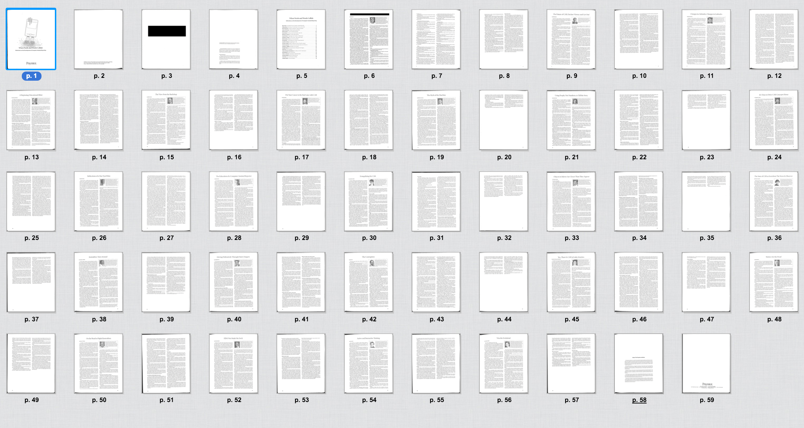

>  If newspapers are going to maintain their "watchdog-of-the-government role", they are going to eventually have to have access to electronic data as well as paper data.
>  
>  That day has come.
>  
>  &ndash; **Larry Sanders**, computer-assisted reporting editor at _USA Today_, in 1991.

# The classic CAR manual: When Nerds and Words Collide

_**When Nerds and Words Collide**: Reflections on the Development of Computer Assisted Reporting_, was first published as a 59-page manual in 1999 by [the Poynter Institute](http://www.poynter.org). But its insights into the work of computer-assisted investigative journalism remain just as true more than 15 years later:

From [its introduction](https://www.documentcloud.org/documents/757701#document/p8):

> In this collection you will find their definitions of CAR, reminiscences of their discovery of CAR, recollections of favorite “How I got ’em” CAR stories, and hard-earned advice to beginners and seasoned journalists venturing into the use of these ways of reporting...
> 
> We hope these essays will give you a sense of where CAR has been, how it got to where it is, and what it needs to keep it going. We’d like you to join us in this effort to better understand and promote the techniques of computer assisted reporting into daily and project journalism.

[Investigative Reporters & Editors](http://ire.org/) has made *When Nerds and Words Collide* [free to download as a scanned PDF](http://store.ire.org/products/when-nerds-and-words-collide-reflections-on-the-development-of-computer-assisted-reporting). 

[DocumentCloud](https://www.documentcloud.org/documents/757701) has an easy-to-browse-within-your-web-browser format:

https://www.documentcloud.org/documents/757701

# Liberate "Nerds and Words" from its PDF Prison

But why settle for  *When Nerds and Words Collide* in PDF format? Let's fight its fight against non-machine-readable formats. Let's free it from its paper tomb and elevate it into the cloud servers, into a new heavenly body with  integrated, multi-platform-functionality!

## Manifest

This repo currently contains:

### Original files

- [pdfs/when-nerds-and-words-collide--tesseract-ocr.pdf](pdfs/when-nerds-and-words-collide--tesseract-ocr.pdf) -- the scanned PDF with OCRed text via Tesseract, as processed and downloaded from [DocumentCloud](https://www.documentcloud.org/documents/757701).
- [pdfs/when-nerds-and-words-collide--abbyy-ocr.pdf](pdfs/when-nerds-and-words-collide--abbyy-ocr.pdf) -- the scanned PDF as processed and OCRed via ABBYY FineReader Pro for Mac.

### PDF-to-HTML conversions

- [html-conversions/single-page/when-nerds-and-words-collide/](html-conversions/single-page/when-nerds-and-words-collide/) - The result of using FineReader Pro to convert the PDF to a __single-page__ HTML file, including a separate folder for all of the external media assets.
- [html-conversions/multi-page/when-nerds-and-words-collide/](html-conversions/multi-page/when-nerds-and-words-collide/) - The result of using FineReader Pro to convert the PDF to HTML, but with _each page_ converted into its own HTML file and assets folder.

### Cleaned files

- [cleaned/multi-page/html/](cleaned/multi-page/html/) - The ABBYY multi-page versions with simplified HTML, as a result of running [scripts/clean_html.py](scripts/clean_html.py). The next step is to convert this to Markdown, which can then easily be edited for mistakes.

### Scripts

- [scripts/clean_html.py](scripts/clean_html.py) - Uses Beautiful Soup 4 to remove all the unnecessary `` and `<a>` and inline CSS HTML in the files inside [html-conversions/multi-page/when-nerds-and-words-collide/](html-conversions/multi-page/when-nerds-and-words-collide/). The result is [cleaned/multi-page/html/](cleaned/multi-page/html/)

## Tentative steps

I think the best approach is to do a quick HTML text extraction on the __multi-page__ conversion, creating a separate text file for each page. People can then make quick fixes to the main body text. And then everything can be glued together, albeit manually (it's only 59 pages).

Feel free to fork/clone this repo. Or suggest [something in the issues](https://github.com/nerdsandwords/poynter-pdf/issues).

- [x] Extract plaintext from the body paragraph elements from every article page in the [multi-page HTML directory](html-conversions/multi-page/when-nerds-and-words-collide/)
- [x] Convert quirky tags, e.g. ``, to more standard tags, e.g. `<strong>`
  - [ ]  Figure out what to do with img tags and assets
- [ ] Convert to a cleaned markdown version 
- [ ] Goad people into doing the manual translation work.
- [ ] Build Jekyll/Middleman static site and deploy
- [ ] ???
- [ ] Prophet

# Special thanks

Send thanks to the [Poynter Institute](http://www.poynter.org/) and [IRE](http://ire.org/) for publishing this manual and making it free to download for future generations of journalists.
